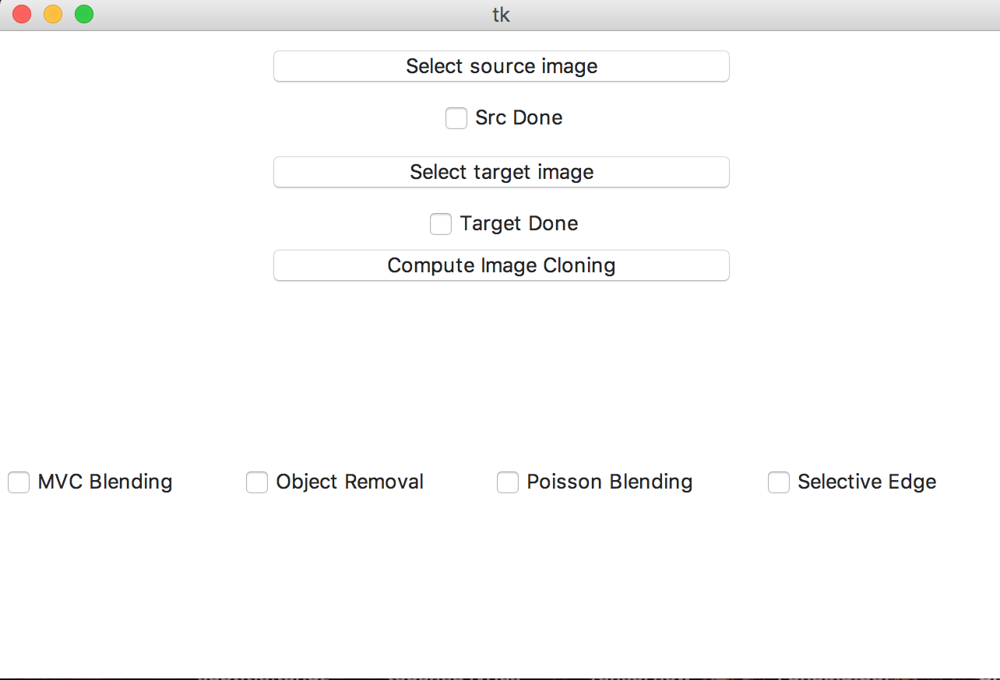
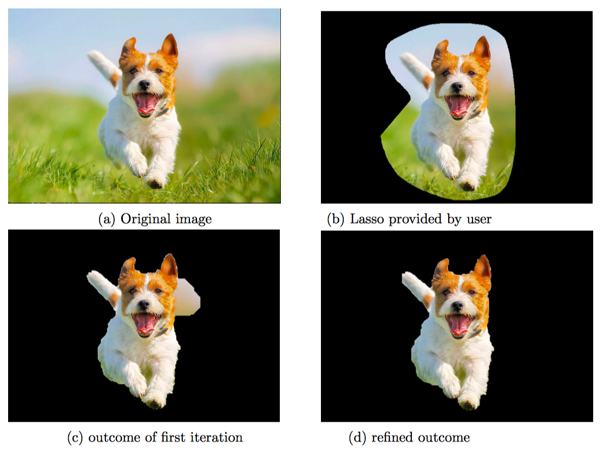
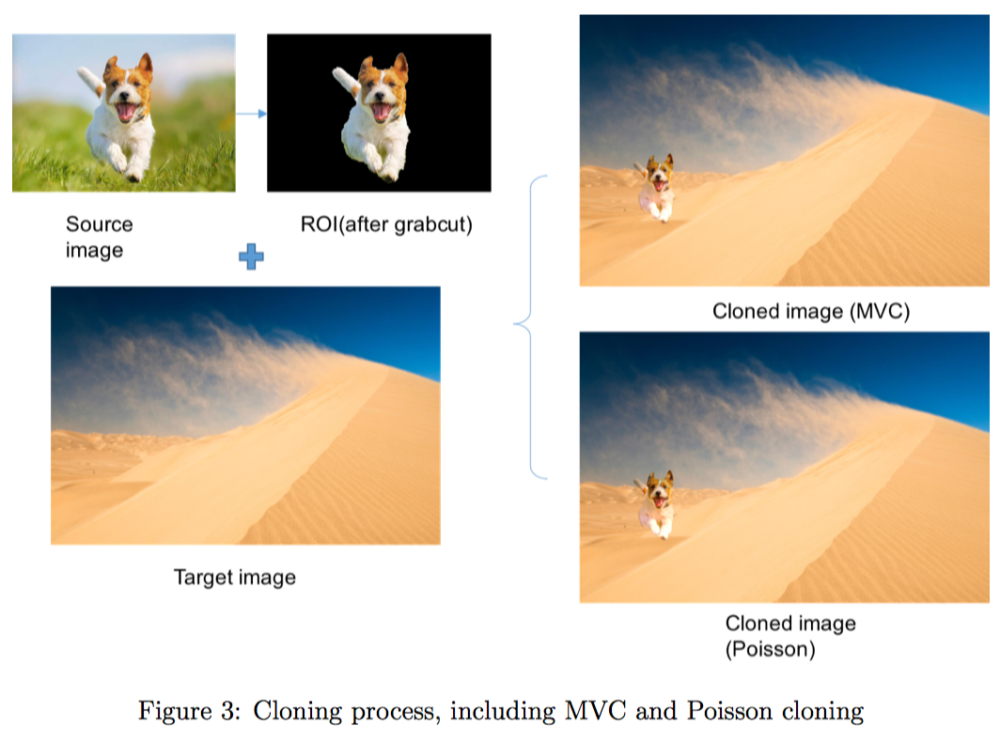

#############################################
#	Coordinate for Instant Image Cloning 	#
#	with Foreground Extraction				#
#############################################

Requirements
---------------------------------------------
* triangle
* pyamg
* pymaxflow
* scikit-learn

Usage
---------------------------------------------
Under src/	
	python3 main.py

1) load image using GUI
2) tick function you want
3) press "compute image cloning"
4) draw contour on image to mark ROI
5) press "Enter" to comfirm, "Spacebar" to redo
6) After calculating, output window will show
	the result of grabcut(automatic if you tick selective edge
	, else you need to press "h".).
7) To refine boundary, press "1" to mark foreground, "0" to mark 
	background.
8) press "Enter" to progress to cloning mode, "Spacebar" to redo.
9) In cloning mode, drag ROI to move to destination you want. And
	"<", ">" to rotate ROI, left-arrow key and right-arrow key to
	zoom in/out.
10) press "Enter" to record this as new target image, you can reload
	other source images and go to step 3). 

** Interface Example    

Introduction
---------------------------------------------
* MVC blending:
  image cloning using MVC
* object removal:
  remove object using neighborhood image as source image
* selective edge:
  using Grabcut to refine image boundary(foreground extraction)

Real Example
---------------------------------------------

